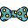

.. _actions:

Actions
=======

Trigger Actions are core of the whole system. They can be anything from simple model imports to complex network creations.
Some can work without any dependency, some would require certain elements, some may require inputs, some can save and store iterations or any
combination of those.
The list of current available Actions in Trigger (October 2021)

.. |assemble| image:: ../../python/trigger/ui/icons/assemble.png
.. |cleanup| image:: ../../python/trigger/ui/icons/cleanup.png

.. |correctives| image:: ../../python/trigger/ui/icons/correctives.png
.. |driver| image:: ../../python/trigger/ui/icons/driver.png
.. |face_cam| image:: ../../python/trigger/ui/icons/face_cam.png
.. |import_asset| image:: ../../python/trigger/ui/icons/import_asset.png
.. |kinematics| image:: ../../python/trigger/ui/icons/kinematics.png
.. |look| image:: ../../python/trigger/ui/icons/look.png
.. |master| image:: ../../python/trigger/ui/icons/master.png

.. |reference_session| image:: ../../python/trigger/ui/icons/reference_session.png

.. |selection_sets| image:: ../../python/trigger/ui/icons/selection_sets.png
.. |shapes| image:: ../../python/trigger/ui/icons/shapes.png
.. |space_switchers| image:: ../../python/trigger/ui/icons/space_switchers.png
.. |split_shapes| image:: ../../python/trigger/ui/icons/split_shapes.png

.. toctree:: 
    :hidden:

    /actions/assemble
    /actions/cleanup
    /actions/cloth_setup
    /actions/correctives
    /actions/driver
    /actions/face_cam
    /actions/import_asset
    /actions/kinematics
    /actions/look
    /actions/master
    /actions/morph
    /actions/node_presets
    /actions/reference_session
    /actions/script
    /actions/selection_sets
    /actions/shapes
    /actions/space_switchers
    /actions/split_shapes
    /actions/weights

- |assemble| :ref:`assemble`
- |cleanup| :ref:`cleanup`
- |cloth_setup| :ref:`cloth_setup`
- |correctives| :ref:`correctives`
- |driver| :ref:`driver`
- |face_cam| :ref:`face_cam`
- |import_asset| :ref:`import_asset`
- |kinematics| :ref:`kinematics`
- |look| :ref:`look`
- |master| :ref:`master`
- |morph| :ref:`morph`
- |node_presets| :ref:`node_presets`
- |reference_session| :ref:`reference_session`
- |script| :ref:`script`
- |selection_sets| :ref:`selection_sets`
- |shapes| :ref:`shapes`
- |space_switchers| :ref:`space_switchers`
- |split_shapes| :ref:`split_shapes`
- |weights| :ref:`weights`