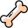

.. _kinematics:

===========================
Kinematics |kinematics|
===========================

Kinematics Action is the core of rigging workflow.
It uses the Trigger Guides created and exported from the Guides Tab in the main menu.

Essentially, it rigs the modular hierarchy starting from the defined root(s)

    - **File Path**: The absolute path to guide file (.trg). The guides must be either created or defined from the Guides tab and exported to a file.
    - **Guide Roots**: Defines where the modular hiearchy starts from. The kinematic rig will be created starting from the given root(s) and branch out to all children recursively. Multiple roots in a single guide can be defined separeted with ";" (eg. => 'jInit_LegRoot_left; jInit_LegRoot_right')
    - **Get Button**: This button is an easy way to define the roots. It looks up to the trg file and drops down a list for all possible root guides in the file.
    - **Create Auto Switchers**: If checked, it tries to create the space switchers automatically as defined per module. Default is on.
    - **After Action**: Defines what will happen to the guide joints after Action runs successfully. Valid options are 'Do Nothing', 'Hide Guides' and 'Delete Guides'. Default state is 'Delete Guides'
    - **Selection Sets**: If checked, creates the selection sets as defined per kinematic module. Default is off.

.. tip:: 
    Defining a Guide Root is not mandatory. In special cases that you want to only import guide joints for later use you can leave it empty and choose "Do Nothing" from After Action modes.